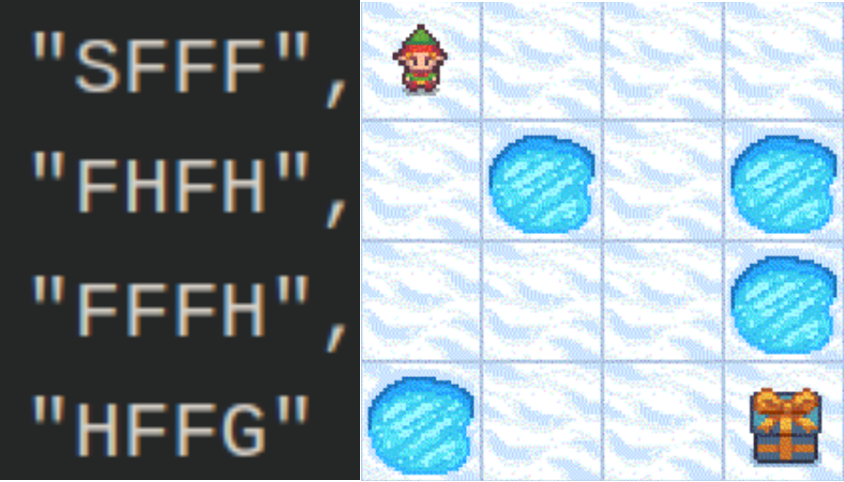
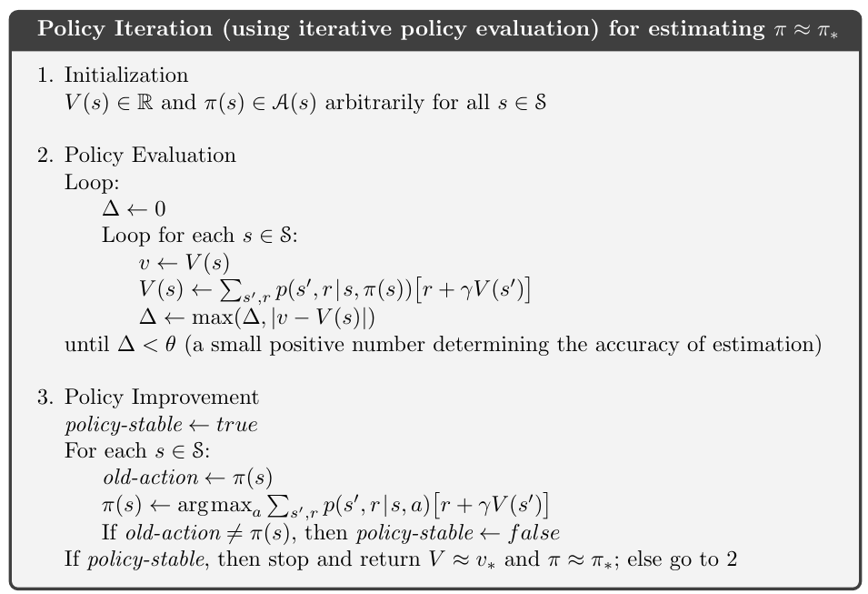
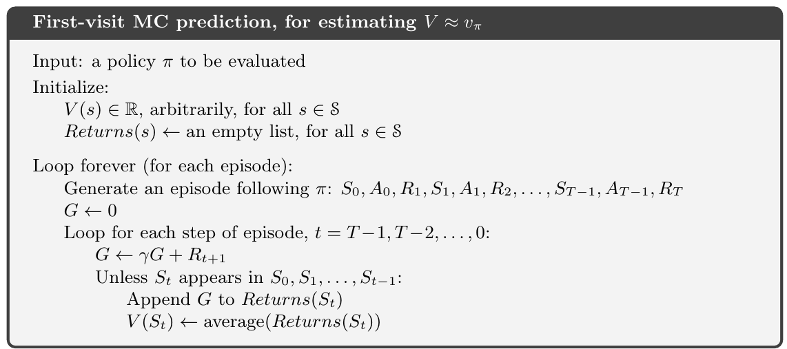
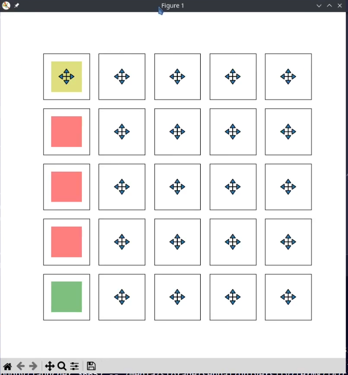
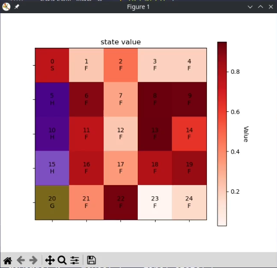

# Reinforcement Learning Project

In this project, we aim to implement three algorithms:
- Policy Iteration
- Monte Carlo (Prediction – First Visit)
- Monte Carlo (Prediction – Every Visit)

Using the OpenAI Gym library in the Frozen Lake environment, we investigate and analyze the impact of reward, discount factor (γ), and determinism in various environments. Several methods for displaying policy values and state values have been implemented for better understanding, and you can utilize them in your project.

## Frozen Lake Environment

The environment consists of navigating through a frozen lake from Start (S) to Goal (G) without falling into any Hole (H) by walking on the Frozen (F) lake. If the agent falls into a hole (H), it must start the traversal again from the starting cell (S). Due to the slippery nature of the frozen lake, the agent may not always move in the intended direction. The agent can move in four directions: left, down, right, and up. If the agent makes a move that crosses the environment boundary, the agent's position does not change. The rewards for reaching each of the states S, G, and F are specified based on the problem under consideration.

For more details, you can refer to the <a href="https://www.gymlibrary.dev/environments/toy_text/frozen_lake/"> -  official documentation. </a>

<table align="center">
  <tr>
    <td align="center">
      
      <br>
    </td>
    </tr>
</table>


## Section 1 – Implementation of Algorithms

To execute the project, start by installing the Gym library. The implemented code is based on Gym version 0.26.2, but you can use other versions of the Gym library or Gymnasium if needed. Note that if you use a different version, you may need to modify specific parts of the implemented code.

Download the code provided in the repository and add it to your project. As you can see, all the necessary methods for interacting with the Gym library, policy display methods, etc., have already been implemented. You can use these methods to carry out your project.
### 1. Policy Iteration
The initial algorithm to implement is Policy Iteration. This algorithm, with a complete view of the environment, starts with a random policy and iteratively reaches the optimal policy. The algorithm has two main steps: Policy Evaluation and Policy Improvement.

- In the first part of this algorithm, using the Bellman equation and the specified policy, it calculates the value of each state.

- In the second part, by selecting an action that maximizes the value of that state, it strives to improve its policy. The pseudocode is as follows:

<table align="center">
  <tr>
    <td align="center">
      
      <br>
    </td>
    </tr>
</table>

```python
# Implement policy iteration using the Policy Evaluation and Policy Improvement steps. In the Policy Evaluation step, you compute
# the state values for each state in the environment using the Bellman equation and the current policy. In the Policy Improvement
# step, you improve the policy by choosing the action that maximizes the value function for each state.
def policy_iteration(env, custom_map, max_ittr=30, theta=0.01, discount_factor=0.9):
    policy = get_init_policy(custom_map)   # it gives a random-walk policy
    V = np.zeros(env.observation_space.n)  # you can change it with any init value
    P = env.P                              # This attribute stores the transition probabilities
                                           # and rewards for each possible action in each possible
                                           # state of the environment.

    # loop till policy_stable becomes True or itter >= max_ittr
    ittr = 0
    policy_stable = False
    while not policy_stable and ittr < max_ittr:
        # policy evaluation

        # policy improvement

        ittr += 1
    return V, policy
```

2. The second algorithm to implement is First-Visit Monte Carlo Prediction. The value of a state is equal to the estimated expected return starting from that state. One clear way to estimate the value of a state from experience is to simply average the observed returns after visiting that state. The algorithm collects and calculates the average return obtained from experience following a specified policy after completing an episode and reaching a terminal state. Note that this algorithm estimates the value of a state only the first time it reaches that state during an episode and does not make any changes to the value if it observes the state again.

<table align="center">
  <tr>
    <td align="center">
      
      <br>
    </td>
    </tr>
</table>

```python
# This algorithm allows you to estimate the state values of a given policy by sampling episodes and
# calculating the average returns(in first visit of a state in each episode)
def first_visit_mc_prediction(env, policy, num_episodes, gamma):
    # initilize
    V = np.zeros(env.observation_space.n)
    N = np.zeros(env.observation_space.n)

    # loop in range num_episodes(for each episode)
    # for i_episode in range(num_episodes):

    # generate episode w.r.t policy

    # loop for each step of episode , t= T-1, T-2, ..., 0

    return V
```

The third algorithm to implement is Every-Visit Monte Carlo Prediction. This algorithm is similar to the first-visit algorithm, with the difference that it considers all instances of encountering a state, not just the first time.

```python
# This algorithm allows you to estimate the state values of a given policy by sampling episodes and
# calculating the average returns(in every visit of a state)
def every_visit_mc_prediction(env, policy, num_episodes, gamma):
    # initilize
    V = np.zeros(env.observation_space.n)
    N = np.zeros(env.observation_space.n)

    # loop in range num_episodes(for each episode)
    # for i_episode in range(num_episodes):

    # generate episode w.r.t policy

    # loop for each step of episode , t= T-1, T-2, ..., 0

    return V
```
## Section 2 – Evaluation and Analysis of Algorithms
After implementing the requested methods, analyze the following aspects and provide reasoning for the obtained results in each section. Report them appropriately.

1. Policy Iteration:

- Describe the approach and results.
- Discuss any observed patterns or challenges.

2. First-Visit Monte Carlo Prediction:

- Explain the methodology and outcomes.
- Discuss the impact of considering only the first visit to a state.

3. Every-Visit Monte Carlo Prediction:

- Present the approach and findings.
- Discuss the differences compared to the first-visit algorithm.


<table align="center">
  <tr>
    <td align="center">
      
      <br>
    </td>
    <td align="center">
      
      <br>
    </td>
    </tr>
</table
